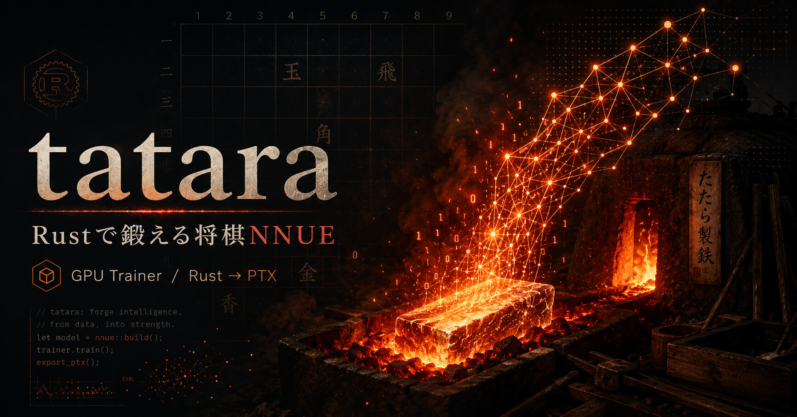

**English** | [日本語](README.ja.md)

# tatara



**A fast Rust trainer for shogi NNUE evaluation networks.**

tatara trains shogi NNUE (Efficiently Updatable Neural Network) evaluation
networks on NVIDIA GPUs. The trainer, data pipeline, and CUDA Driver API runtime
are written in Rust, while the native GPU backend compiles hand-fused CUDA C++
kernels with NVCC into an embedded fat binary.

The [cuda-oxide](https://github.com/NVlabs/cuda-oxide) Rust → PTX backend is
also maintained as the default Cargo feature and as a numerical and performance
reference for the native backend. A `native-cuda-host` build uses only the
NVCC-built kernels and portable Rust host runtime, without cuda-oxide. The
`native-cuda` feature enables parity and benchmark comparisons across both
device backends; it builds the NVCC fat binary only, so generate the cuda-oxide
PTX first with `bash scripts/build-kernels.sh` (see
[docs/native-cuda-benchmark.md](docs/native-cuda-benchmark.md)).

Hand-fusing the GPU kernels makes it **very fast** — the measured cuda-oxide
backend out-throughputs its upstream CUDA C++ trainer
[bullet-shogi](https://github.com/SH11235/bullet-shogi), while the native backend
keeps the same fused training design.

**cuda-oxide vs bullet-shogi (measured on RTX 3080 Ti)**: for LayerStack, even the
bit-identical default path is **+37%**, and stacking the opt-in FP16 modes reaches
up to **~2.1×**. For Simple (HalfKP `512x2-8-64`) it is around **+20%** on the
default and around **+55%** with `--all-optim` (FP16/TF32).

**Throughput** (`--batch-size 65536`, pos/s; fp32 → `--all-optim` (fp16/tf32)). The
`--all-optim` gain is larger on older, more bandwidth-bound GPUs and on bigger nets:

| arch / config (feature) | RTX 5090 | RTX 3080 Ti |
|---|---|---|
| LayerStack `--ft-out 1536` (`halfka-hm-merged`) | 2.45M → 3.13M (+28%) | 0.99M → 1.59M (+61%) |
| LayerStack `--ft-out 768` (`halfka-hm-merged`) | 4.24M → 5.10M (+20%) | 2.05M → 2.97M (+45%) |
| Simple `256x2-32-32` (`halfkp`) | 11.29M → 13.37M (+18%) | 7.30M → 10.10M (+38%) |

Measurement command (teacher-data / progress paths are environment-specific;
compare pos/s with and without `--all-optim`):

```sh
# LayerStack (halfka-hm-merged, needs progress)
cargo run --release --bin nnue-train -- \
  --data /path/to/teacher.psv --progress-coeff /path/to/progress.bin \
  --feature-set halfka-hm-merged --batch-size 65536 --superbatches 8 [--all-optim] \
  layerstack --ft-out {1536|768} --l1 {16|8} --l2 32

# HalfKP (simple, no progress needed; the simple trainer requires --win-rate-model)
cargo run --release --bin nnue-train -- \
  --data /path/to/teacher.psv \
  --feature-set halfkp --batch-size 65536 --superbatches 8 [--all-optim] \
  --scale 290 --win-rate-model \
  --wrm-in-offset 0 --wrm-target-offset 0 \
  --wrm-in-scaling 290 --wrm-target-scaling 290 --wrm-nnue2score 290 \
  simple --arch 256x2-32-32
```

The simple trainer only supports the win-rate-model loss (its int8 output
layer cannot represent the centipawn-scale output that the plain sigmoid loss
converges to). The `--wrm-*` values above degenerate the WRM to a plain
sigmoid; use the same scale for `--scale` and every `--wrm-*-scaling` /
`--wrm-nnue2score`, since `--scale` also sets the exported `fv_scale`.

*tatara (踏鞴), the traditional Japanese furnace that smelts iron sand (raw
material) into tamahagane steel — forging a net out of raw data.*

> **NVIDIA only** — both GPU backends target NVIDIA CUDA; ROCm / AMD is out of
> scope. To train comparable shogi NNUE nets on an AMD GPU, see the upstream
> [bullet-shogi](https://github.com/SH11235/bullet-shogi), which has both CUDA
> and HIP backends.

## What you can train

A trained NNUE is defined by two independent choices: the **architecture**
(a subcommand), which fixes the network structure, and the **input feature set**
(`--feature-set`), which fixes how a board position is turned into an input
vector.

### Architecture

| Architecture | Subcommand | Structure |
|---|---|---|
| **LayerStack** | `layerstack` | Specializes the output layer per position bucket. `--bucket-mode progress8kpabs` uses progress coefficients and 2–9 buckets; `--bucket-mode kingrank9` uses YaneuraOu KingRank9 with exactly 9 buckets and no progress coefficients. FT output `--ft-out` (default 1536) → `--l1` (default 16) → `--l2` (default 32) |
| **Simple** | `simple` | A plain NNUE with no bucket split (FT → 2 hidden layers → single output). Layer dimensions are set with `--arch <l1>x2-<l2>-<l3>` (`l1` = FT output, `l2`/`l3` = hidden layers; default `256x2-32-32`); activation crelu / screlu / pairwise |

### Input feature set

`--feature-set` selects one of five (default `halfka-hm-merged`). They differ in
how the kings are included as features:

| `--feature-set` | King handling |
|---|---|
| `halfkp` | Kings themselves are not included as piece features |
| `halfka-split` | Kings are included; own-king and enemy-king features have separate slots |
| `halfka-merged` | Kings are included; own-king and enemy-king features share one slot |
| `halfka-hm-split` | `halfka-split` plus a left-right mirror so the king always sits on one side of the board, compressing king squares 81 → 45 |
| `halfka-hm-merged` (default) | `halfka-merged` plus the same left-right mirror king-square compression |

The default `halfka-hm-merged` applies to shogi the same design as Stockfish's
**HalfKAv2_hm** (left-right king-square mirroring + own-king/enemy-king features
sharing one slot).

A separate binary, `progress-kpabs-train`, is a KP-abs progress trainer that
produces `progress.bin`, the bucket coefficients for LayerStack. The approach of
learning game progress and assigning it to output buckets is based on an idea
from [a post by nodchip](https://nodchip.hatenablog.com/entry/2026/02/04/000000).

## Setup

### Requirements

- **OS** — Linux is first-class; Windows is supported via WSL2, with experimental
  native Windows support through `native-cuda-host`; macOS cannot build the GPU
  crates
- **NVIDIA GPU** (see the backend-specific support matrix in `docs/setup.md`)
- **CUDA Toolkit 12.x** (verified with 12.9)
- **NVCC** for `native-cuda-host`; **LLVM 21+** and `cargo-oxide` for the default
  cuda-oxide backend
- **Rust nightly** (pinned in `rust-toolchain.toml`)

For the native CUDA C++ build command, cuda-oxide setup, detailed per-OS
instructions, and the supported-GPU matrix, see [docs/setup.md](docs/setup.md).

### Build and train

For building the kernels and running the smoke test, see
[docs/setup.md](docs/setup.md); for how to run training, see
[docs/training-quickstart.md](docs/training-quickstart.md).

## Documentation

- [Setup guide](docs/setup.md) — per-OS guidance, native CUDA / cuda-oxide build
  setup, supported-GPU matrix, CUDA toolkit root resolution
- [Training quickstart](docs/training-quickstart.md) — per-architecture training
  examples + key CLI options + resume / checkpoint workflow
- [Game-progress buckets: preparing `progress.bin`](docs/progress-bin.md) —
  training the LayerStack bucket coefficients and surveying the bucket split
- [End-to-end training benchmark](docs/bench-pos.md) — reproducible real-data
  throughput measurement on Linux/WSL and native Windows
- [Held-out validation](docs/held-out-validation.md) — `test_loss` / `test_acc`
  setup, choosing the held-out source, and reading the metrics
- [Training schedules](docs/training-schedule.md) — scheduling the learning rate
  (`--lr-schedule`) and the WDL lambda (`--wdl` / `--start-wdl` / `--end-wdl`)
  across a run
- [ADR (Architecture Decision Records)](docs/decisions/) — design decisions and
  their rationale
- [Fused kernel catalog](docs/kernels/fused-pattern-catalog.md) — which kernel
  does what
- [Arch string](docs/arch-string.md) — how the architecture-description string
  embedded in the quantised `.bin` header is assembled and checked at load time
  (Japanese only)
- [Converting between tatara and YaneuraOu LayerStack nets](docs/net-to-yaneuraou.md) —
  `net_to_yo` / `net_from_yo` usage, supported architecture, and binary layout (Japanese only)

## Using the trained net

The quantised `.bin` that tatara produces is designed to be loaded by the
[rshogi](https://github.com/SH11235/rshogi) engine. The `.bin` header and the
SCReLU / Pairwise activations are specific to this project, so other shogi
engines such as YaneuraOu cannot necessarily load it as-is; depending on the
architecture, some nets need additional inference code before they can be
loaded. A supported LayerStack net can be converted to and from the YaneuraOu
format with [`net_to_yo` / `net_from_yo`](docs/net-to-yaneuraou.md).
Pre-trained reference nets are attached to the
[GitHub Releases](https://github.com/SH11235/tatara/releases). To train your
own net, see the [setup guide](docs/setup.md).

## Glossary

| Abbreviation | Meaning |
|---|---|
| **NNUE** | Efficiently Updatable Neural Network — a lightweight evaluation function used by shogi / chess engines |
| **FT** | Feature Transformer — the NNUE's sparse-input → dense layer |
| **L1f** | The bucket-independent (shared across all buckets) L1 dense layer of the LayerStack architecture; its output is added to the per-bucket L1 output |
| **PSV** | PackedSfenValue — a training-data format from bullet-shogi (one position + score + WDL) |
| **HCPE** | HuffmanCodedPosAndEval — the 38-byte Apery / dlshogi position, score, move, and game-result format |
| **KP / KP-abs** | King-Piece relative feature and its absolute-value variant (for progress / entering-king detection) |
| **bucket** | Per-output-bucket weight separation (branching by game phase / progress) |
| **PSQT** | Piece-Square Table — a linear per-piece-per-square evaluation table. The LayerStack `--psqt` option adds a per-bucket PSQT output to the network output so the dense path only has to learn non-material structure |
| **EffectBucket** | Feature-set extension that maps each base feature row to `base_index * NB + effect_bucket`, where `EffectBucket=<config>` in the arch string records the bucket count and whether king features are bucketed |
| **FT factorizer** | Training-time virtual FT rows shared across king buckets (LayerStack; **ON by default**, disable with `--no-ft-factorize`). Each virtual row learns the king-bucket-independent component of one piece plane and is folded into the real rows on export, so the `.bin` shape and inference are unchanged. The same idea as nnue-pytorch's feature factorizer (whose default feature set `HalfKAv2_hm^` is also factorized). Works together with `--psqt` (the PSQT block gets the same virtual rows); `--init-from` automatically disables it (logged, since a quantised `.bin` has no virtual rows) |
| **CReLU / SCReLU / Pairwise** | NNUE activation functions. CReLU = Clipped ReLU, SCReLU = Squared Clipped ReLU, Pairwise = elementwise product of the first and second halves, halving the input dimension. Selected by `--activation` on the `simple` architecture |
| **RAdam / Ranger** | Rectified Adam / Ranger optimizer (Ranger = RAdam + lookahead) |
| **WRM** | Win-rate model loss (from bullet `--win-rate-model`) |
| **QA / QB / FV_SCALE** | Quantisation scale constants. QA = the FT weight / bias quantisation multiplier (on the `simple` architecture it is set by the activation: 127 for CReLU / Pairwise, 255 for SCReLU); QB = dense-weight scale (64). Activation outputs are always on a 127 scale regardless of activation, so FV_SCALE = `round(127 × QB / training scale)` is the factor that converts the net output back to a centipawn evaluation |
| **WDL** | Win/Draw/Loss — the game-result target (1.0 / 0.5 / 0.0) blended against the teacher score by the WDL lambda; see [docs/training-schedule.md](docs/training-schedule.md) |
| **CV** | Coefficient of variation — sample standard deviation divided by the mean, reported as a percentage for benchmark run-to-run variability |
| **SPRT** | Sequential Probability Ratio Test — a method that plays two nets against each other and sequentially tests the strength difference. Used to confirm the quality of a trained net |
| **superbatch** | A bullet term: the unit of "multiple batches treated as one, advancing the lr/wdl scheduler" |
| **PTX** | Parallel Thread Execution — a virtual ISA for NVIDIA GPUs. CUDA C++ / Rust → PTX (`.ptx` text) → the CUDA driver's JIT compiles it to SASS (real machine code) for execution. It is portable across generations (PTX built for sm_80 runs forward-compatibly on sm_86/89/90). See the supported-GPU matrix in `docs/setup.md` |
| **SASS** | Per-generation real machine code for NVIDIA GPUs. The terminal form the CUDA driver JIT produces from PTX. This repository does not handle it directly |
| **sm_XX** | The compute capability of an NVIDIA GPU (e.g. sm_75 = Turing, sm_86 = Ampere RTX 30xx). Used to specify the target architecture when generating PTX (`CUDA_OXIDE_TARGET=sm_86`, etc.) |

## Related repositories

- [rshogi](https://github.com/SH11235/rshogi) — the shogi engine that loads and plays with the NNUE trained here
- [bullet](https://github.com/jw1912/bullet) — upstream (NNUE training framework)
- [bullet-shogi](https://github.com/SH11235/bullet-shogi) — a shogi-oriented fork of bullet
- [cuda-oxide](https://github.com/NVlabs/cuda-oxide) — the Rust → PTX rustc backend

## License

MIT (see [LICENSE](LICENSE)).
For the scope of code taken from bullet-shogi / bullet / cuda-oxide and license
compatibility, see [ATTRIBUTION.md](ATTRIBUTION.md).
